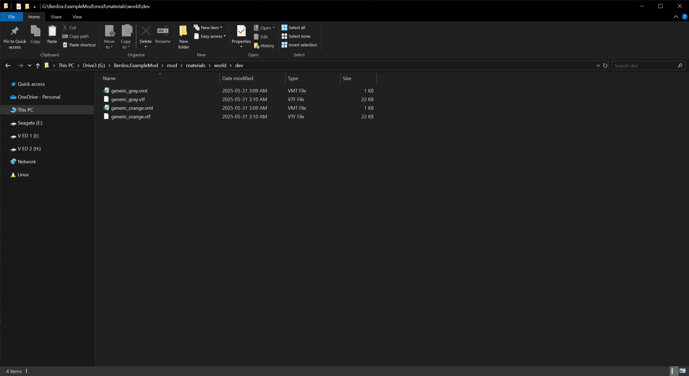

# Textures

MRVN Radiant is a brush-based level editor used for creating custom maps for Titanfall 2. In MRVN, most surfaces such as floors,
walls, and ceilings are made up of brushes. These brushes are textured using image files mapped onto their surfaces.

---

## Setting Up Texture Paths

Proper texture paths are important because both MRVN and Titanfall 2 rely on these paths to locate texture files.

In MRVN, textures are referenced relative to the `textures/` directory. When you apply a texture to a brush, MRVN looks inside this folder to match the path.
Titanfall 2 expects those same textures to be defined either by `.vmt/.vtf` materials (VMT method) or embedded in `.rpak` files (RPAK method) using the exact same relative path.

---

### Step 1: Folder Structure

First, create a folder for your custom assets. The simplest structure looks like this:

```
<your_custom_folder>/
└── textures/
```

MRVN looks for textures inside the `textures/` folder, so this folder is required.

A more complete structure may look like:

```
<your_custom_folder>/
├── textures/
│   ├── world/        # Textures for brush geometry
│   │   ├── dev/      # Developer grid and debug textures
│   │   ├── walls/    # Wall textures
│   │   └── floor/    # Floor textures
│   ├── model/        # Model-specific textures (not commonly used)
│   └── skybox/       # Skybox textures (currently not implemented in MRVN)
└── model/            # 3D models (OBJ or mdl format) used in MRVN
```

It is strongly recommend downloading the [MRVN Resource Pack](https://github.com/MRVN-Radiant/MRVN-Resource-Pack).
The pack includes helpful assets such as spawnpoint models, other entity models, and utility textures commonly used in Source Engine
and Titanfall development. It also provides a reference for proper folder structure.

---

### Step 2: Add Resource Path in MRVN

1. Launch MRVN Radiant.
2. Press `P` to open **Preferences**.
3. Navigate to the **Games/Paths** section.
    
4. Click the folder icon next to "Extra Resource Path".
5. Select the folder you created in Step 1.

**Important:** Add the **parent folder** (the one that contains the `textures/` folder), not the `textures/` folder itself.


---

After adding your custom folder and the MRVN Resource Pack, your list of resource paths should resemble this:


---

The only textures you should have right now is the ones added in the MRVN Resource pack and your MRVN Radiant should look like this.


---
### Step 3: Add Textures to the `textures/` Folder

MRVN supports multiple image formats such as `.png`, `.dds`, and other image formats. These image files are used to apply textures to
geometry within the editor.

However, **Titanfall 2 requires that the in-game material file (either a `.vmt` or a compiled `.rpak` material) matches the texture path
exactly as used in MRVN.** This path must reflect everything after the `textures/` folder.

#### Example Full File Path:

```
G:\MRVN textures\textures\world\dev
```

Only this portion is relevant to MRVN and Titanfall 2:

```
world\dev
```

If your paths do not match, Titanfall 2 will not be able to locate and apply the correct texture during runtime.

#### Example Usage

Used in MRVN:
```
world/dev/generic_grey.png
```

Used in Titanfall 2 (VMT method):
```
world/dev/generic_grey.vmt
```

Ensure the filename (excluding file extension) and folder structure are **exactly the same** for both the texture file and the material file.

---

#### Example Folder and MRVN Preview

Here is an example of a correctly structured texture folder and how it appears inside MRVN:


---

### Step 4: Loading Textures in Game

There are two main methods for loading textures into the game for use in your custom map: the **VMT method** and the **RPAK method**.

The **VMT method** is quicker and easier to set up, making it ideal for testing or simple projects. However, it offers limited
control over how textures appear in-game, and the visual quality may be lower.

The **RPAK method** requires more setup, as it involves using [RePak](../../repak/map.md) and creating a JSON file to compile
your textures into an `.rpak` file. While this method is more complex, it provides greater control over texture behavior and appearance.

---

#### VMT Method

The VMT method uses `.vmt` (Valve Material Type) and `.vtf` (Valve Texture Format) files to define and load materials. You will need to
convert your `.dds` or other image texture file into a `.vtf`
using [VTFEdit Reloaded](https://github.com/Sky-rym/VTFEdit-Reloaded/releases) or other tools. There are two main ways to use this method:

1. **Using a `materials/` folder in your mod (recommended)**

    The simplest approach is to create a `materials/` folder inside your mod folder.

    ```
    ExampleMod/mod/materials
    ```
    Place your `.vmt` and `.vtf` files there, following the correct folder structure that matches the paths used in MRVN.

    Example folder structure:
    

2. **Using a VPK file**

    Alternatively, you can package your `.vmt` and `.vtf` files into a `.vpk` (Valve Pak) file and have your mod load it at runtime.

    Example VPK setup:
    

---

Here is an example of a simple `.vmt` file:

```vmt
LightmappedGeneric
{
    $basetexture "world/dev/generic_gray"
    $surfaceprop "concrete"
}
```

The `$basetexture` line defines the path to your `.vtf` texture file, relative to the `materials/` folder if you use method 1. In this
example, it refers to `materials/world/dev/generic_gray.vtf`.


---

#### RPAK Method

The RPAK method involves using [RePak](../../repak/map.md) to compile your `.dds` texture files into material entries into a `.rpak` based
on a JSON configuration.

After generating the `.rpak` file make sure the `.rpak` is named the same as your bsp map file. This makes sure the `.rpak` loads properly
with the map.
Place the `.rpak` file(s) into the `pak/` folder within your mod directory. The game will automatically load them from there.

Example folder layout:


---

##### Optional: Using `rpak.json` for Custom `.rpak` Load Behavior

You can optionally include an `rpak.json` file in your `pak/` folder to control how your RPAK files are handled by the game.
This allows you to specify preload and postload behavior, or set up aliases for existing RPAK files.

For more details, see the [RPAK Modding Guide](../../guides/tools/rpakmodding.md).

## Common Problems

- Applying a texture in MRVN using one path, but placing the material in a different one for titanfall 2.
- Forgetting to include a `.vmt` or material definition for the texture when packaging the map.
- Using spaces or capital letters inconsistently between image and material paths.
- Not including the correct `pak/`, `materials/`, or `textures/` folders in your mod structure.
